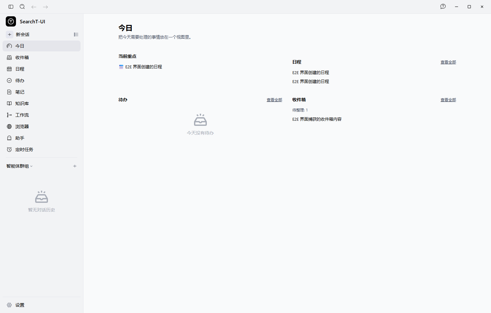
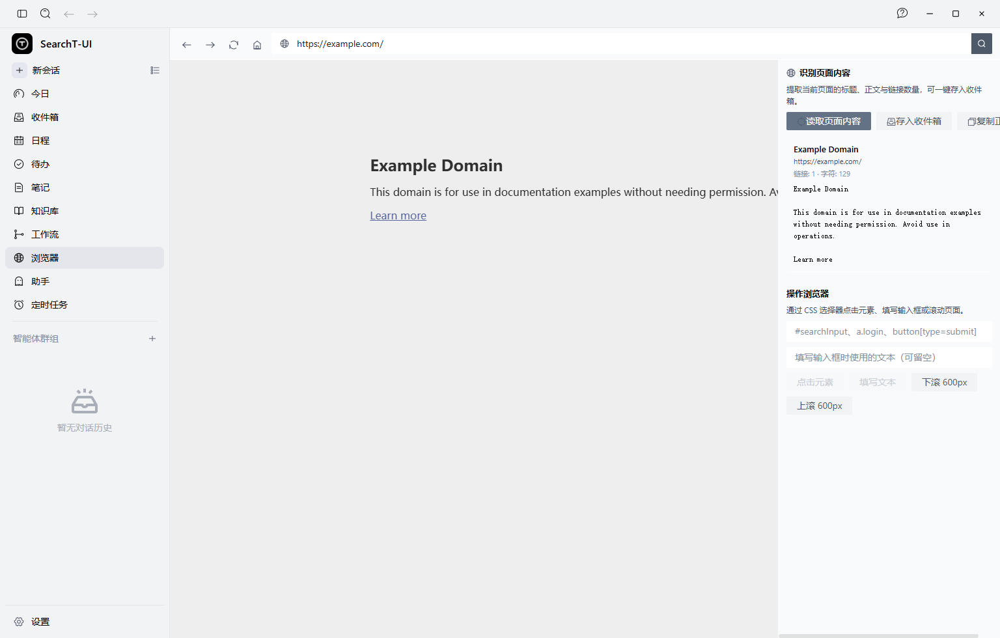
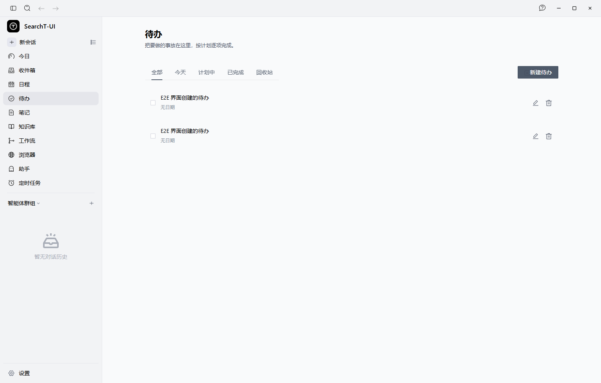
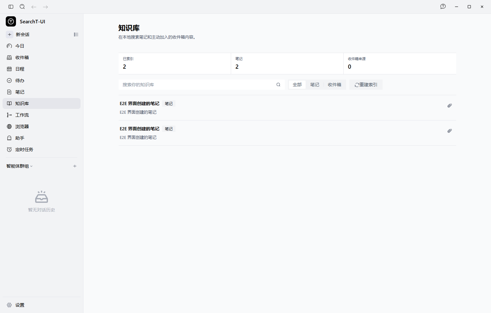
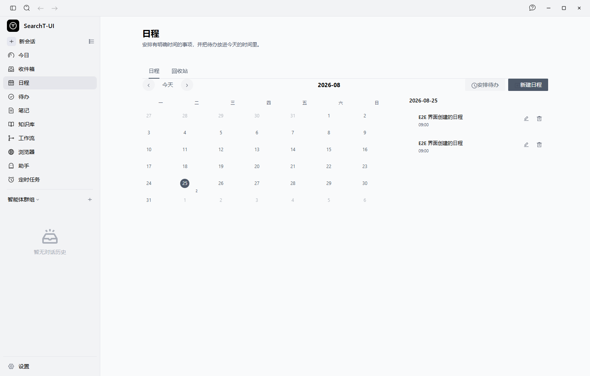
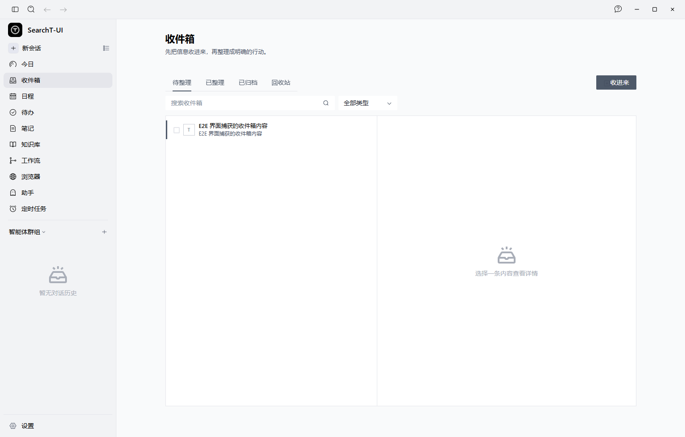
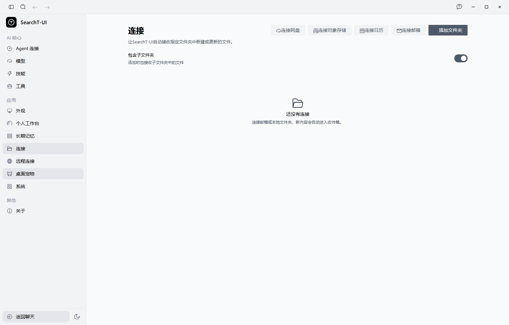
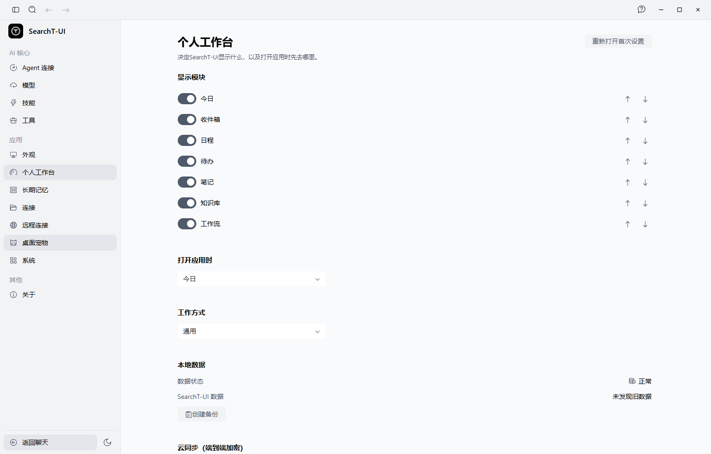

# SearchT-UI

**A local-first AI personal workspace.** SearchT-UI 把日程、待办、笔记、知识库、收件箱、长期记忆、技能沉淀、工作流和本机 Agent 协作放进一个可离线使用的桌面应用——你的数据保存在本机，AI 在你身边工作。


## 界面预览

真实应用截图（v2.1.53，中文界面）。

| 今日工作台                                                                                            | 内嵌浏览器                                                                                              |
| ----------------------------------------------------------------------------------------------------- | ------------------------------------------------------------------------------------------------------- |
|                                                               |                                              |
| 当前重点、日程、待办、收件箱一屏聚合                                                                   | 应用内浏览网页，一键识别正文存入收件箱，支持 CSS 选择器程序化操作                                        |

| 待办与日程                                                                                             | 知识库与收件箱                                                                                          |
| ----------------------------------------------------------------------------------------------------- | ------------------------------------------------------------------------------------------------------- |
|                                                                     |                                                                 |
|                                                                  |                                                                     |
| 重复规则、提醒、日历视图                                                                               | 全文检索的知识库；多来源待整理收件箱                                                                     |

| 连接器设置                                                                                            | 个人工作区设置                                                                                          |
| ----------------------------------------------------------------------------------------------------- | ------------------------------------------------------------------------------------------------------- |
|                                                    |                                                    |
| WebDAV / S3 / 邮箱 / iCal 日历订阅                                                                     | 数据目录、云同步（端到端加密）等                                                                         |

> 截图采集脚本：`node scripts/e2e/capture-screenshots.cjs`（需以 `--remote-debugging-port=9222` 启动应用）。

## 功能总览

| 领域       | 能力                                                                                                  |
| ---------- | ----------------------------------------------------------------------------------------------------- |
| 个人工作台 | 今日、待办（含重复规则）、日程（提醒）、笔记（版本历史）、知识库（全文检索）、收件箱、回收站与恢复    |
| 内嵌浏览器 | 应用内浏览/搜索网页；一键读取页面正文存入收件箱；通过 CSS 选择器点击/填表/滚动实现程序化操作          |
| 群组协作   | 本机 Agent 群聊（分工、@提及、结果汇总、失败恢复）；邀请码与真人成员加入                              |
| 长期记忆   | 记忆候选审核、确认入库、过期与遗忘、语义检索                                                          |
| 技能沉淀   | 候选审核、不可变版本发布、回滚、启停                                                                  |
| 工作流     | 模板安装、定时运行、审批与权限（grant）管理                                                           |
| 连接器     | 本地文件夹、QQ/163 邮箱、坚果云/WebDAV 只读、S3 兼容存储、iCal 日历订阅（飞书/Outlook/钉钉/企业微信） |
| 云同步     | 端到端加密（AES-256-GCM + scrypt），WebDAV/S3 通道、每记录三方合并、墓碑、冲突副本、离线队列          |
| 数据自主   | 独立数据目录、端到端加密备份、旧版 AionUi 一键迁移（计划→导入→报告→回滚）                             |

## 快速开始

```bash
# 依赖要求：Node.js >= 22
bun install           # 或 npm install
npm run dev           # 启动桌面开发版
npm test              # 全量单元测试（4600+ 用例）
npm run dist:win      # 构建 Windows 安装包（dist:mac / dist:linux 同理）
```

首次启动会引导你完成六步设置：工作方式 → 工作台 → 模型与隐私边界 → 连接服务意向 → 权限确认 → 本机 Agent 检测。

## 数据位置

| 平台    | 路径                                                                |
| ------- | ------------------------------------------------------------------- |
| Windows | `%APPDATA%\SearchT-UI\searcht\`（个人数据库 `searcht-personal.db`） |
| macOS   | `~/Library/Application Support/SearchT-UI/searcht/`                 |
| Linux   | `~/.config/SearchT-UI/searcht/`                                     |

自动更新默认关闭；运维方可通过 `SEARCHT_UPDATE_BASE_URL` 指向自建 HTTPS 更新源（见 `docs/release/searcht-release-runbook.md`）。

## 开发文档

- 发布流程与安装器调用规范：`docs/release/searcht-release-runbook.md`
- 产品需求基线：`docs/prds/workspaces/searcht-personal-workspace.md`
- 本机功能级 E2E：`scripts/e2e/local-machine-e2e.ts`（需 Electron 运行时）
- UI 走查：`scripts/e2e/ui-walkthrough.cjs`（CDP 驱动真实窗口）

## 许可

Apache-2.0。SearchT-UI 衍生自 AionUi（Apache-2.0）并做了深度改造；按 Apache-2.0 第 4 条要求，再分发时请保留上游版权声明（各源文件头部 SPDX 标识）。
